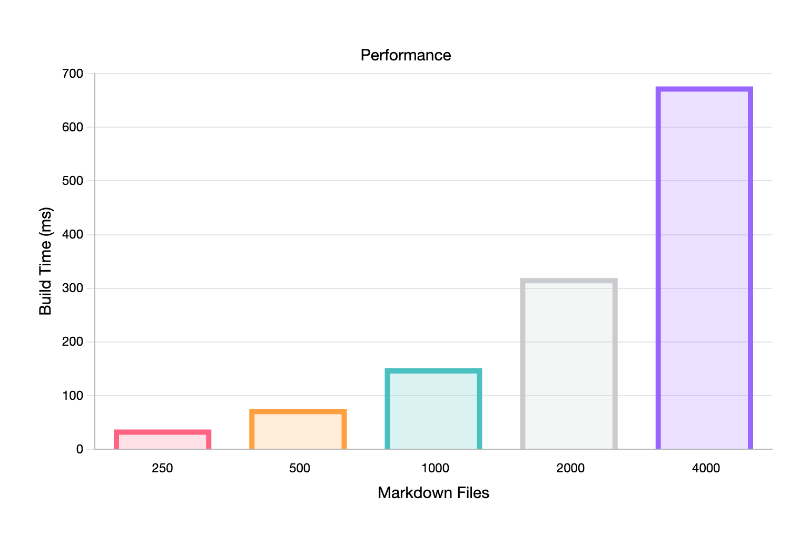

Oyez, Oyez, All Who Dare Attend!

Behold, the dawn of a new era in static site generation! The latest incarnation of Maudit has now been released unto the realm. Within this update, marvels and shadows entwine to create a tapestry of features to—

...

_More seriously_, this is the first release of **Maudit** (/mo.di/), a static site generator written in Rust.

<div class="text-center italic">Want to just get started using Maudit? Check out our <a href="/docs/quick-start/">Quick Start guide</a></div>

## What's in a Maudit?

Maudit is a non-opinionated flexible static website generator with a modern development experience. What we mean by that is that Maudit is able to create any kind of static websites, from personal blogs to documentation sites, all while providing a enjoyable development workflow with all the tools you might need.

If you like vanilla JS and CSS, that's good with us! If you prefer using fancy TypeScript and Tailwind CSS, we won't hold it against you either! Maybe you're a fan of this weird templating library that no one knows, Maudit can accommodate that too. It's cool.

We hope to make Maudit the go-to choice if you want a static site generator that puts you in control, tries to get out of the way and let you own your website.

## Not quite your overlord

[Maudit is built like a library, not a framework.](/docs/philosophy/#maudit-is-a-library-not-a-framework) A Maudit project is a normal Rust project, nothing more, nothing less. A Maudit page is a normal Rust struct in a normal `.rs` file.

```rs
use maudit::page::prelude::*;

#[route("/")]
pub struct Index;

impl Page for Index {
    fn render(&self, ctx: &mut RouteContext) -> RenderResult {
        "Hello World".into()
    }
}
```

That said, we hope to avoid as much boilerplate as possible, as such fancy macros are involved at times. But, we're not much into magic either, so expanding those macros should still yield code that is easy to understand.

Our goal is to strike a balance between convenience and clarity. It shouldn't feel like there's a lot of impossible to understand weird code happening behind the scenes.

## Reasonably fast

In general, if there's a compromise to be made, we prefer to optimize for developer experience over raw performance. However, we still aim to keep Maudit fast enough for most use cases.

On a 2020 M1 MacBook Pro, [we've found that the final binary of a Maudit project can build a project with 4000 Markdown files in around 700ms](https://github.com/bruits/maudit/tree/main/benchmarks/md-benchmark), which we consider quite reasonable.

[](https://github.com/bruits/maudit/tree/main/benchmarks/md-benchmark)

As we add more features, it's possible that Maudit will become slower, but we'll monitor performance and ensure that, yeah, it's reasonably fast.

## A whole lot ahead

This first version offers as solid of a foundation a first version can offer, and can be used to make functional websites already (such as this one!). But, as with any new project, there are bound to be rough edges, some very obvious areas for improvement and a whole lot of missing features.

We keep a [roadmap](https://github.com/bruits/maudit/issues/1) up to date with our plans for the future.

## Join the coven

[Maudit is open source, licensed under MIT](https://github.com/bruits/maudit), and we would be thrilled to receive your contributions, no matter your skill level. Whether it's code, documentation, design, issues, or just spreading the word, every little bit helps.

We also have a [Discord server](/chat) where you can chat with other users and contributors. We hope to see you there!

## Get started

To get started with Maudit, check out the [official documentation](/docs). It covers everything from installation to advanced usage.

We're very excited to see what you build with Maudit, and we hope you'll find it as enjoyable to use as we do!
